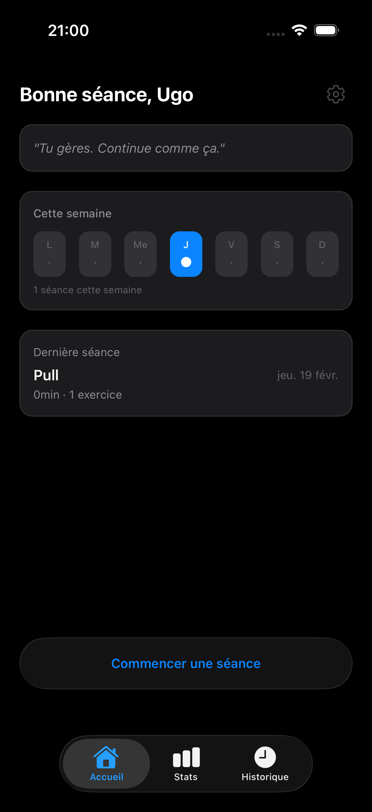
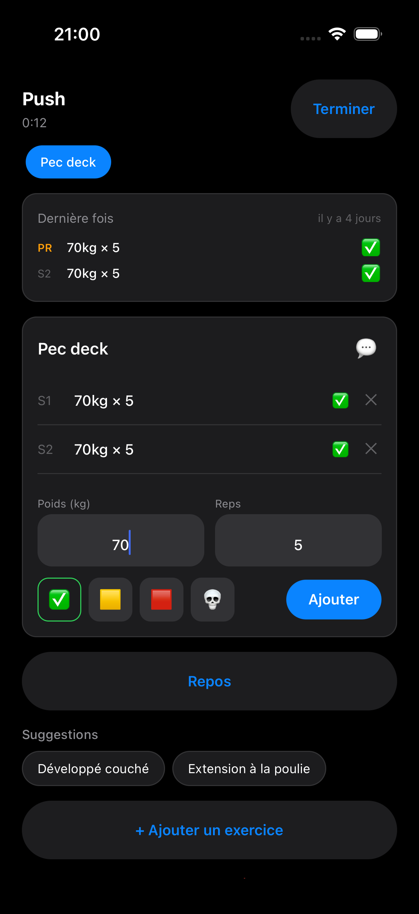
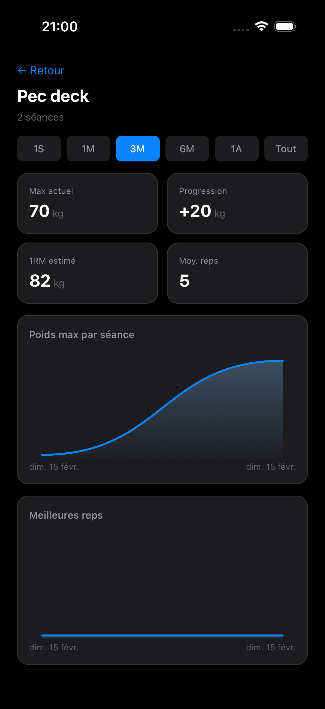
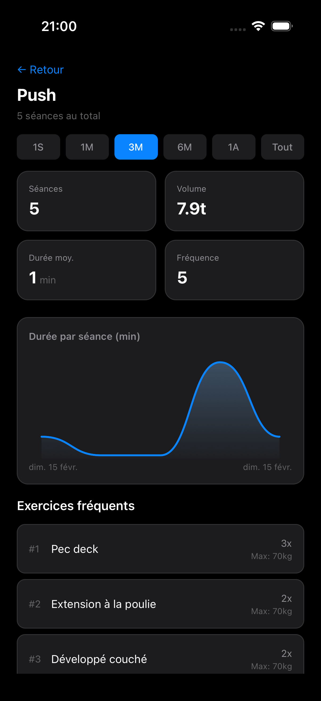
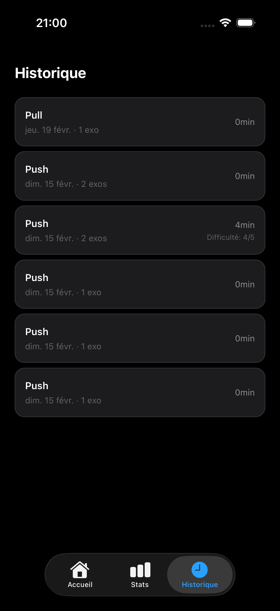

# WorkoutTracker

[Francais](#fr) | [English](#en)

---

<a name="fr"></a>

## FR

Application iOS native pour enregistrer ses seances de musculation en temps reel. Suivi des series, statistiques de progression, et export/import des donnees.

<p align="center">
  
  
  
</p>

### Fonctionnalites

**Suivi de seance en temps reel**
- Demarrer une seance Push, Pull, Legs ou personnalisee
- Logger ses series : poids, reps, statut, echec musculaire
- Timer de repos avec notification locale (fonctionne en arriere-plan)
- Suggestions d'exercices basees sur l'historique
- Commentaire par exercice

**Statistiques et progression**
- Vue d'ensemble : seances totales, volume, duree moyenne
- Stats par exercice : poids max, 1RM estime (Epley), graphes de progression
- Stats par type de seance : frequence, exercices favoris, tendances de duree
- Selecteur de periode (1S, 1M, 3M, 6M, 1A, Tout)
- Insights automatiques : progression, stagnation, records

<p align="center">
  
  
  
</p>

**Historique**
- Liste de toutes les seances passees avec nombre d'exercices, duree et note
- Vue detaillee avec toutes les series par exercice
- Suppression par long press

**Gestion des donnees**
- Export de toute la base en JSON (via share sheet iOS)
- Import sur un autre appareil : fusion intelligente (dedup exercices par nom) ou remplacement total
- Toutes les donnees stockees localement en SQLite

### Installer sur iPhone (Sideloading)

L'app n'est pas sur l'App Store. Pour l'installer :

1. Telecharger `WorkoutTracker.ipa` depuis la [derniere release](https://github.com/ufalzone/WorkoutTracker-v1/releases/latest)
2. Installer avec un de ces outils :
   - **[AltStore](https://altstore.io)** — Gratuit, re-signe automatiquement tous les 7 jours
   - **[Sideloadly](https://sideloadly.io)** — Gratuit, necessite une re-signature manuelle tous les 7 jours
3. Faire confiance au certificat : Reglages → General → VPN et gestion des appareils

> **Note :** Avec un Apple ID gratuit, l'app expire apres 7 jours et doit etre re-installee. AltStore peut automatiser ce processus.

### Stack technique

| Couche | Technologie |
|--------|------------|
| Framework | React Native + Expo SDK 54 |
| Navigation | Expo Router (file-based) |
| Base de donnees | expo-sqlite (5 tables, migrations) |
| State | Zustand (seance en cours uniquement) |
| Styling | NativeWind v4 (Tailwind CSS) |
| UI | Liquid Glass (iOS 26), dark mode |
| Graphes | react-native-svg (courbes bezier) |

### Compiler depuis les sources

```bash
# Installer les dependances
npm install --legacy-peer-deps

# Lancer sur simulateur iOS
npx expo run:ios

# Verification TypeScript
npm run typecheck
```

> Necessite Xcode avec un runtime simulateur iOS installe.

---

<a name="en"></a>

## EN

A native iOS workout tracking app built with React Native and Expo. Log your sets in real-time, track your progression with detailed statistics, and never lose your data with JSON export/import.

<p align="center">
  
  
  
</p>

### Features

**Real-time session tracking**
- Start a Push, Pull, Legs or custom session
- Log sets with weight, reps, status and optional muscle failure toggle
- Rest timer with local notifications (works in background)
- Exercise suggestions based on your history
- Comments per exercise

**Statistics & progression**
- Overview: total sessions, volume, average duration
- Per-exercise stats: max weight, estimated 1RM (Epley), progression charts
- Per-session-type stats: frequency, top exercises, duration trends
- Period selector (1W, 1M, 3M, 6M, 1Y, All)
- Automatic insights: progression, stagnation, records

<p align="center">
  
  
  
</p>

**History**
- Browse all past sessions with exercise count, duration and rating
- Detailed view with all sets per exercise
- Delete sessions via long press

**Data management**
- Export your entire database as JSON (via iOS share sheet)
- Import on another device with merge (smart exercise deduplication) or full replace
- All data stored locally with SQLite

### Install on iPhone (Sideloading)

This app is not on the App Store. To install on your iPhone:

1. Download `WorkoutTracker.ipa` from the [latest release](https://github.com/ufalzone/WorkoutTracker-v1/releases/latest)
2. Install using one of these tools:
   - **[AltStore](https://altstore.io)** — Free, re-signs automatically every 7 days
   - **[Sideloadly](https://sideloadly.io)** — Free, requires manual re-signing every 7 days
3. Trust the developer certificate: Settings → General → VPN & Device Management

> **Note:** With a free Apple ID, the app expires after 7 days and needs to be re-installed. AltStore can automate this.

### Tech Stack

| Layer | Technology |
|-------|-----------|
| Framework | React Native + Expo SDK 54 |
| Navigation | Expo Router (file-based) |
| Database | expo-sqlite (5 tables, migrations) |
| State | Zustand (live session only) |
| Styling | NativeWind v4 (Tailwind CSS) |
| UI | Liquid Glass (iOS 26), dark mode |
| Charts | react-native-svg (bezier curves) |

### Build from Source

```bash
# Install dependencies
npm install --legacy-peer-deps

# Start on iOS simulator
npx expo run:ios

# Type check
npm run typecheck
```

> Requires Xcode with an iOS simulator runtime installed.

---

## Project Structure

```
src/
├── app/              # Expo Router screens
│   ├── (tabs)/       # Tab bar: Home, Stats, History
│   ├── session/      # Active session flow
│   ├── stats/        # Exercise & session-type stats
│   └── settings.tsx  # Preferences, export/import
├── components/       # Reusable UI components
├── db/               # SQLite schema, migrations, queries
├── hooks/            # Custom React hooks
├── store/            # Zustand store (session state)
├── lib/              # Utilities, constants, export/import
└── types/            # TypeScript interfaces
```

## Database Schema

```
exercises            # Exercise catalog (name, muscle group, cable flag)
workout_sessions     # Sessions (type, label, timestamps, rating)
exercise_logs        # Exercise occurrences in a session (order, comment, weight factor)
sets                 # Individual sets (weight, reps, status, muscle failure)
custom_workout_types # User-created session types
```

## License

MIT
